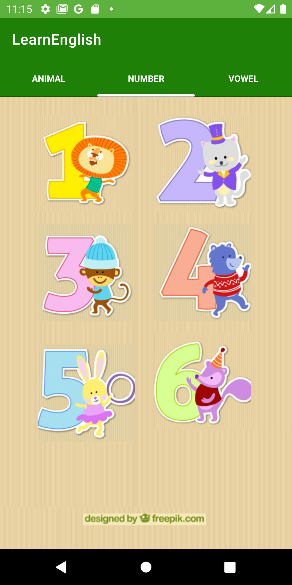

## An Android App example of how to Play Sounds in Java

* Android ConstraintLayout
* Android MediaPlayer

 
 
 

  

### Reference
* https://developer.android.com/training/constraint-layout
* https://developer.android.com/guide/topics/media/mediaplayer?hl=pt-br
* https://www.freepik.com/home
